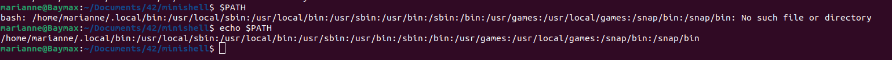

* [readme formatting](https://docs.github.com/en/get-started/writing-on-github/getting-started-with-writing-and-formatting-on-github/basic-writing-and-formatting-syntax)

# To do

* [ ] clean header and files
* [ ] put everything to the norm
* [ ] est-ce que check paths uniquement quand exec ou avant ?
* [ ] remove comments in files
* [ ] est-ce que les outfiles se crééent si un infile n'est pas bon ? comparer avec bash
* [ ] remettre access dans free_groups
* [ ] verifier si tous les strdup sont bien proteges
* [ ] echo -nnn
* [ ] enlever envp = NULL

* [x] parse si commande est valable
* [x] n'est pas valable si ruling quotes pas pair
* [x] est valable si commande est "vide" (geree par exec, penser a bien mod la var de g_ret)
* [x] creer variable ```$?``` et assign var globale dds, ou plutot si lancee juste afficher g_ret ?
* [x] put builtins in the main program
* [x] put env in the main program
* [x] deal if env vide with the new env system (char * and not linked list)
* [x] en fonction des quotes, "charger" var ou non
* [x] reigning quotes in c to epur properly
* [x] signaux
* [x] why cmd empty causes program to close
* [x] heredoc ne doit pas update l'history (sujet, parsing donc + Marianne)
* [x] if c is only sep -> if no token after (```coucou | ```) syntax error, if token after (```coucou | > salut```) syntax error on ```>```, if just empty cmd without any redir token, just change glob variable to 2 for unproper use of bash
* [x] si env normal, créer `$?` a la fin, donc faire une fonction à part lors de l'init
* [x] passer heredoc en readline plutôt qu'en GNL ? pour qu'on puisse utiliser flèche droite/gauche
* [x] vérifier sur les PC de l'école si les droits des fichiers outfile sont les bons
* [x] dans heredoc, ne prend pas en compte si single ou double quotes, il prend tous les $ pour une var d'env
* [x] syntax unvalid token like `<<>` or `<<<<`
* [x] echo accuracy
* [x] UNSET syntax
* [x] pourquoi invalid syntax ne se lance que pour le token de debut despite putting it in other ones too


### Chourael
* [ ] redirections
* Chemin absolu ET relatif (sujet) -> si env -i, cwd va donner quoi ? donc relatif va donner quoi ??
* [ ] heredoc
* heredoc ne doit pas update l'history (sujet, parsing donc + Marianne)

### Marianne
* [ ] normer ft_export

* [x] env
* [x] make that envp = envi
* [x] builtins
* [x] finish parsing quotes
* [x] find where the issue with empty cmd ends up closing
* [x] fix ft_strncmp comp in loop
* [x] parsing if syntax error on sep depending on the cmd


* [x] expand str in case of ENV variable
* [x] if unset don't translate var env !!!
* [x] $_ n'est pas géré puisque ```_``` n'est pas alphanum donc chercher comparaison
* [x] finir ft_export
* [x] export : SHLVL, if value non numerical, set SHLVL to 0, if num, set to val - 1

* [x] parsing end token
* [x] vérifier que ft_free_and_ret ne leaks pas quand on export sera fait
* [x] si juste espace sur la ligne doit juste afficher un retour à la ligne et pas une erreur
* [x] si char pas fittable dans le nom d'une var d'env, alors il est possible de s'arrêter !
* [x] faire bool si cmd est cense etre un fichier ou pas

### Builtins modifications
* [ ] changer la valeur de retour de chaque fonction (doit pouvoir retourner un code erreur en fonction du soucis, par exemple cd et echo peuvent retourner des valeurs d'erreurs différentes)
* [x] adapter les fonctions aux structs
* [ ] changer printfs et perror en ft_printf_fd
* [x] pour ft_cd :
* [x] ft_cd : renvoyer bon message d'erreur si fichier et si pas existant
* [x] pour ft_echo : gérer les quotes, les espaces et les variables d'env depuis raw_str
* [x] pour ft_unset : leak lorsqu'on unset le premier elem de l'env, somehow

## Case 1



## Case 2


* When unset SHLVL, SHLVL is set as 0 but still in env

## Case 3
* OLDPWD will only be in the env when cd has been used since the launch of the terminal : needs to be changed once cd is created
* Issue : readline quand chaine vide ferme le prog, alors que le terminal just new prompt

## Note


## Env variable syntax
* [Env variable syntax 1](https://stackoverflow.com/questions/2821043/allowed-characters-in-linux-environment-variable-names)
* [Env variable syntax 2](https://pubs.opengroup.org/onlinepubs/000095399/basedefs/xbd_chap08.html)
## IO redirect
* [IO redirect](https://tldp.org/LDP/abs/html/io-redirection.html)